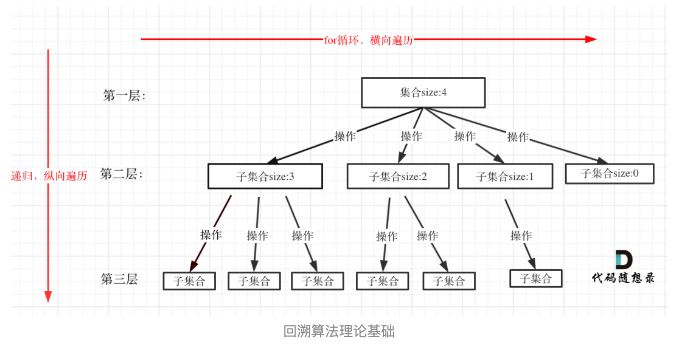

# 回溯法
回溯法来解决n个for循环的问题，用递归来控制for循环嵌套的数量。

## 可以解决的问题
（1）组合问题：N个数里面按照一定规则找出K个数的集合  
  
（2）切割问题：一个字符串按照一定规则有多少切割条件  

（3）子集问题：N个数的集合里面有多少符合条件的子集  

（4）排列问题：N个数按照一定规则全排列，有多少中排列方式   

（5）棋盘问题：N皇后、解数独    

## 所有的回溯法，都可以抽象为[树形]问题
回溯法都是在集合中递归查找子集，集合的大小就构成了树的宽度，递归的深度构成了树的深度。 
  
算法模板如下   

    void backtracking(参数) {
        if (终止条件) {
            存放结果;
            return;
        }

        for (选择：本层集合中元素（树中节点孩子的数量就是集合的大小）) {
            处理节点;
            backtracking(路径，选择列表); // 递归
            回溯，撤销处理结果
        }
    }

有的题目需要startIndex来控制for循环的起始位置，
对于【组合】问题，什么时候需要startIndex呢？
如果是一个集合来求组合的话，就需要startIndex，
如果是多个集合取组合，各个集合之间互不影响，那么就不用startIndex

如果原始题目有重复元素，而且结果要求不能有重复结果，那么就要去重。
去重，分为树枝去重、树层去重。可借助used[]数组，
在candidates[i] == candidates[i - 1]相同的情况下：
used[i - 1] == true，说明同一【树支】candidates[i - 1]使用过
used[i - 1] == false，说明同一【树层】candidates[i - 1]使用过

【切割问题】
如果能想到用组合问题的思路来解决切割问题，那么问题就成功了一大半。
切割问题：起始点到切割线（或者两个切割线之前的全部元素）之间的元素都是作为组合问题中的一个元素。

【子集问题】
【子集问题】是要搜集【所有节点】的结果，【组合问题】是要搜集所有【叶子节点】的结果
子集问题，可以理解为，每次从原集合中选择一个元素，加入结果集，然后再从剩下的元素中选择下一个，知道所有元素选择完毕。
子集问题去重，仍然可以借助used[]数组。（或者也可以借助set集合）

【排列问题】
排列问题，每层都是从0开始，不是startIndex开始；
需要used[]数组记录path里都放了那些元素。

【去重问题】
使用used[]数组和set都可，但是used数组效率更高。

【重新安排行程问题】
因为题目要求有序，可以是用TreeMap作为存储初始图数据的数据结构。

【N皇后、数独问题】
双层循环，难点是如何模拟，那些数据不能放入，那些数据能够放入。