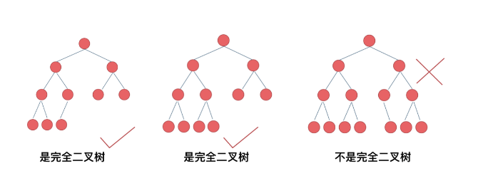

## 二叉树的主要形式
满二叉树：二叉树只有度为0和度为2的节点，度为0的节点在同一层上。
  
完全二叉树：除了底层节点可能没有填满，其余位置每层节点都达到最大值。
底层节点都集中在该层的最左边的若干位置。

二叉搜索树：
二叉搜索树是有数值的，且有序：若左子树不为空，则左子树上的节点都小于他的根节点，若右子树不为空则右子树上的所有节点都大于根节点。

平衡二叉搜索树（AVL ==> Adelson-Velsky and Landis）
是一颗空树，或者他的左右子树的高度差的绝对值不超过1，且左右子树也是一颗平衡二叉树。

## 二叉树的存储方式：
（1）链表（左右指针）、
（2）数组（父节点的数组下表是i，那么它的左孩子就是i * 2 + 1，右孩子就是 i * 2 + 2）。

## 二叉树的遍历
深度优先遍历：
    前序、中序、后续；（前中后，指的是中间节点的位置）
广度优先遍历：
    层次遍历；

## 二叉树的深度
深度：从【[根节点]】到【最远的[叶子节点]】的【最长路径上】的【节点数】。
深度是[从上到下]。
例如，求二叉树的最小深度，只有，只有当左右孩子都为空，才说明遍历到了最低点了。如果其中一个孩子为空则不是最低点。
求深度，对应前序遍历（从上到下），也可用层次遍历。

高度：某个节点的高度：指从该节点到叶子节点的最长简单路径边的节点数。
高度是[从下到上]数节点。 对应后序遍历（从下到上）

## 递归的一点小说明
如果需要[搜索整颗二叉树]且[不用处理递归返回值]，递归函数[就不要返回值]。（这种情况就是本文下半部分介绍的113.路径总和ii）  
如果需要[搜索整颗二叉树]且需[要处理递归返回值]，递归函数就[需要返回值]。（这种情况我们在236. 二叉树的最近公共祖先介绍）  
如果要[搜索其中一条]符合条件的路径，那么递归[一定需要返回值]，因为遇到符合条件的路径了就要及时返回。（本题的情况）  

递归函数什么时候加if、什么时候不加if ？    
如果让空节点（空指针）进入递归，就不加if；  
如果不让空节点进入递归，就加if限制一下， 终止条件也会相应的调整。